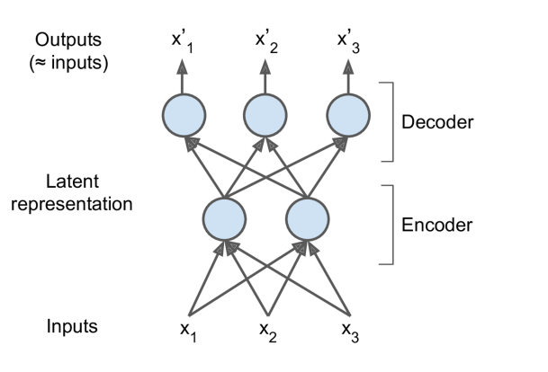
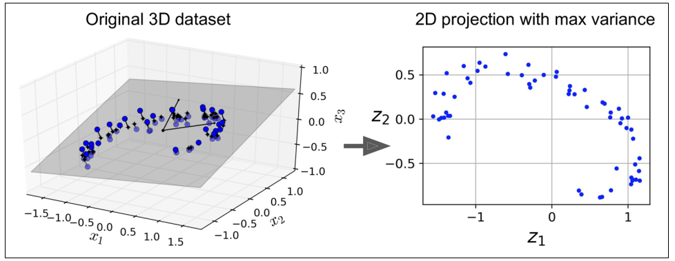
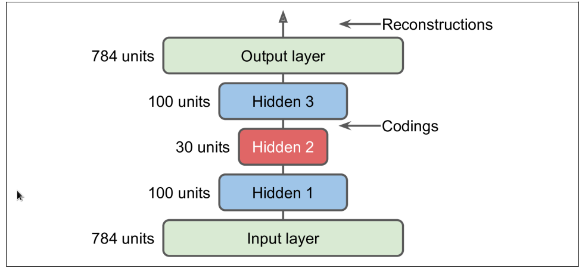
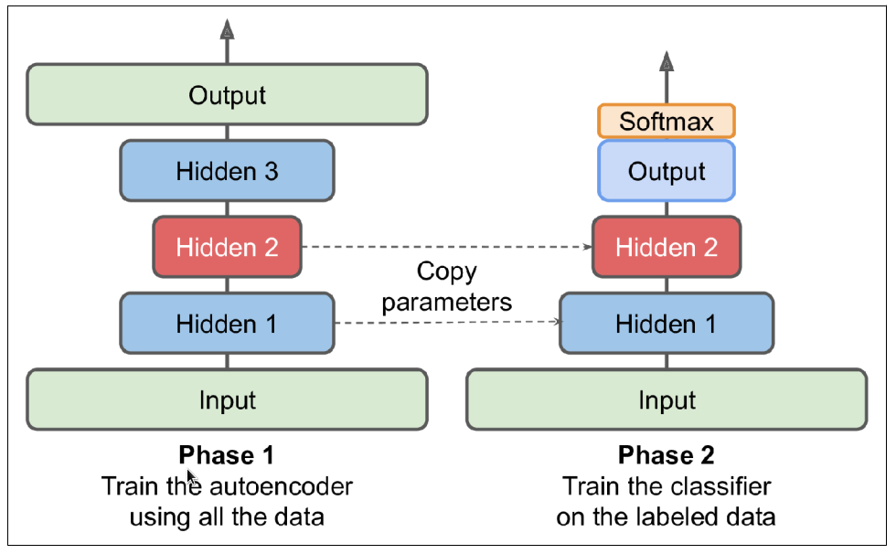
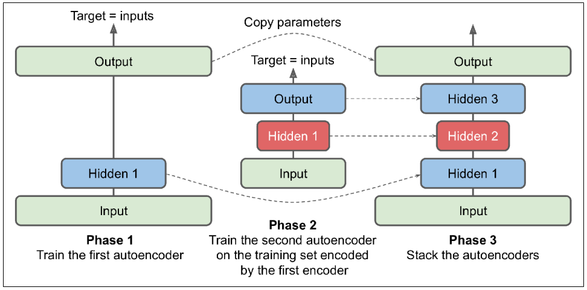
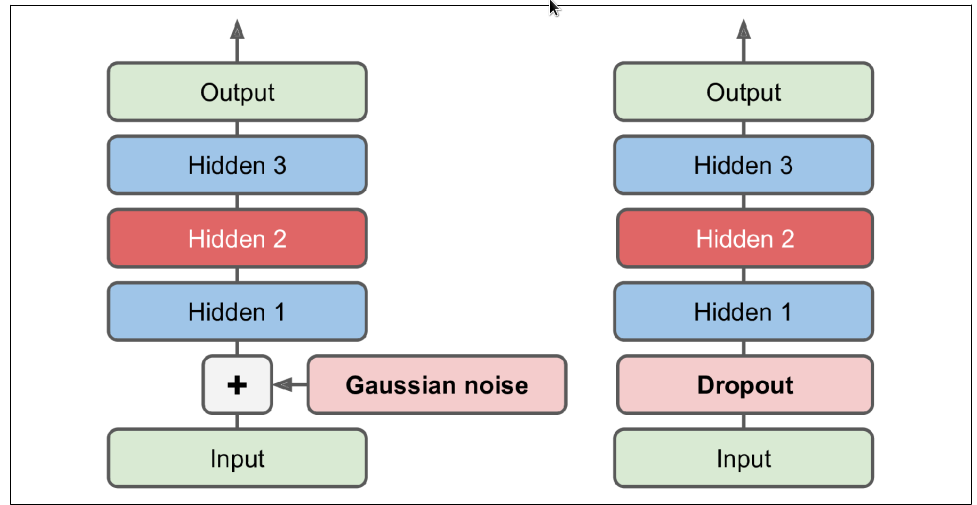
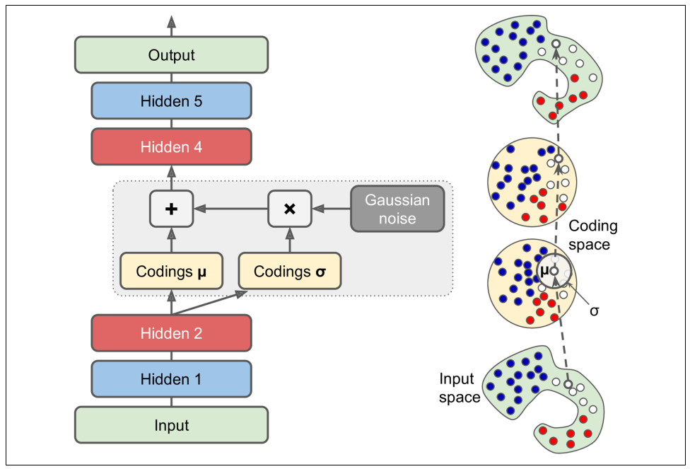

This Project is meant to be a **theoritical** Cource I provide some code but in the abstract way you can readit to understand the concept we refer to some reference in this notebook and the most important reference is 
[Hands‑On Machine Learning with Scikit‑Learn, Keras](https://www.amazon.com/Hands-Machine-Learning-Scikit-Learn-TensorFlow-dp-1492032646/dp/1492032646/ref=dp_ob_image_bk) it is amazing book and I recomend every one has an interest in machince learning and Deep learning to read it.

# Autoencoders
**Autoencoders** are artificial **neural networks** capable of learning dense representations
of the input data $PDF$, called *latent representations* or codings, without any *supervision*.


what mean by that it's **unsuprvised Learning** the **Goal** of this type of learning is to learn hidden structure of data. 

These codings typically have a much lower *dimensionality ==latent* than the input data, making autoencoders useful for **dimensionality reduction**

Autoencoders also act as **feature detectors** and pass the output of this model to **Neural Network**.

Autoencoders are also **generative models**.

# Generative models:
take as input training samples and learn a model the represent of that distribution

*example*: you could train an autoencoder on pictures of faces, and it would
then be able to generate new faces

However, the generated images are usually fuzzy and not entirely realistic

faces generated by **generative adversarial networks (GANs)** are now so
convincing that it is hard to believe that the people they represent do not exist. You
can judge so for yourself by visiting https://thispersondoesnotexist.com/, a website that
shows faces generated by a recent GAN architecture called StyleGAN.

you can read more about **GAN** hear http://GAN.com


# How Autoencoders work?
Autoencoders simply learn to copy their inputs to their outputs. This may sound
like a trivial task, but we will see that constraining the network in **various ways**
can make it rather difficult. For example, you can limit the size of the latent representations,
or you can add **noise** to the inputs and train the **network** to recover
the original inputs. These constraints prevent the autoencoder from trivially
copying the inputs directly to the outputs, which forces it to learn efficient ways
of representing the data. In short, the codings are byproducts of the autoencoder
learning the identity function under some constraints

an autoencoder looks at the inputs, converts them to an efficient **latent representation**, and then spits out some‐
thing that (hopefully) looks very close to the inputs. An autoencoder is always composed of two parts: an **encoder (or recognition network)** that converts the inputs to a
latent representation, followed by a **decoder (or generative network)** that converts the
internal representation to the outputs

As you can see, an autoencoder typically has the same architecture as a **Multi-Layer
Perceptron** except that the number of **neurons** in the output
layer must be equal to the number of inputs. In this example, there is just one hidden
layer composed of two neurons (the **encoder**), and one output layer composed of
three neurons (the **decoder**). The outputs are often called the **reconstructions** because
the autoencoder tries to reconstruct the inputs, and the **cost function** contains a
reconstruction loss that penalizes the model when the reconstructions are different
from the inputs.
example of reconstruction loss $ min||X_i - X_(output) ||^2$ where $X_i $ is traning example.

Because the internal representation has a lower dimensionality than the input data (it
is 2D instead of 3D), the autoencoder is said to be *undercomplete*. An undercomplete
autoencoder cannot trivially copy its inputs to the codings, yet it must find a way to
output a copy of its inputs. It is forced to learn the most important features in the
input data (and drop the unimportant ones).

Let’s see how to implement a very simple **undercomplete autoencoder** for dimensionality reduction.

# undercomplete autoencoder
in order to force the autoencoder to learn interesting features, we have
limited the size of the coding layer,and that what we called undercomplete and the kind of this autoencoders are (**basic Autoencoder**, **Stacked Autoencoder**, **CNN Autoencoder**, **RNN Autoencoder**) 

# Performing PCA with an Undercomplete Linear Autoencoder
If the autoencoder uses only linear activations and the cost function is the mean
squared error **mean squre error(MSE)**, then it ends up performing **Principal Component Analysis(PCA)**

The following code builds a simple linear autoencoder to perform **PCA** on a 3D dataset, projecting it to 2D


```python
#code 
from tensorflow import keras


encoder = keras.models.Sequential([
            keras.layers.Dense(2, input_shape=[3])
         ])


decoder = keras.models.Sequential([
            keras.layers.Dense(3, input_shape=[2])
         ])


autoencoder = keras.models.Sequential([
              encoder, 
              decoder
              ])

autoencoder.compile(loss="mse", optimizer=keras.optimizers.SGD(lr=0.1))
```

as we can see there is no activation function in all layer and the neuron in output layer is the same as input layer 


```python
autoencoder.fit(X_data, X_data)   Note that X_data is the input and the target
```

### Note:
You can think of autoencoders as a form of self-supervised learning
(i.e., using a supervised learning technique with automatically generated labels, in this case simply equal to the inputs).



# Stacked Autoencoders

Just like other **neural networks** we have discussed, autoencoders can have multiple
**hidden layers**. In this case they are called **stacked autoencoders**

The architecture of a **stacked autoencoder** is typically symmetrical with regard to the
central **hidden layer** (the coding layer). To put it simply, it looks like a sandwich. For
example, an autoencoder for *MNIST*  may have 784 inputs,
followed by a hidden layer with 100 neurons, then a central hidden layer of 30 neu‐
rons, then another hidden layer with 100 neurons, and an output layer with 784 neurons.



```python
#code
import tensorflow.keras as keras

stacked_encoder = keras.models.Sequential([
        keras.layers.Flatten(input_shape=[28, 28]),
        keras.layers.Dense(100, activation="selu"),
        keras.layers.Dense(30, activation="selu"),
    ])
stacked_decoder = keras.models.Sequential([
        keras.layers.Dense(100, activation="selu", input_shape=[30]),
        keras.layers.Dense(28 * 28, activation="sigmoid"),
        keras.layers.Reshape([28, 28])
    ])

stacked_ae = keras.models.Sequential([
                stacked_encoder,
                stacked_decoder
             ])

stacked_ae.compile(loss="binary_crossentropy", optimizer=keras.optimizers.SGD(lr=1.5))

history = stacked_ae.fit(X_train, X_train,...) 

you can use this code to train your model
```

# Unsupervised Pretraining Using Stacked Autoencoders

f you have a large dataset but most of it is unlabeled, you can first train a
**stacked autoencoder** using all the data, then reuse the lower layers to create a **neural
network** for your actual task and train it using the **labeled data**. For example,
*Figure* shows how to use a stacked **autoencoder** to perform **unsupervised** **pretraining** 
for a **classification** neural network. When training the **classifier**, if you really
don’t have much labeled training data, you may want to **freeze** the pretrained layers
(at least the lower ones).



# Tying Weights

When an autoencoder is neatly **symmetrical** by symmetrical autoencoder we mean that the encoder layer is as the decoder layer in the inverse way, a common
technique is to *tie* the **weights** of the **decoder** layers to the weights of the **encoder** layers.
This halves the number of weights in the model, speeding up training and limiting the risk of **overfitting**

this is an aowsem technique to use,this come from linear algebra.

if i **multiplie matrix** $M$ by **vector** **v** then the result is vector **u**.
if the $M$ is invertabel then I can multiplie **u** with $M^-1$ to return back to **v**

and as we know if the Matrix is  Symmetric then the inverse is $M^T$.

the idea if Tying Weights it's depend on the previous explaining the code below show the coustom DenseTranspose layer. 

source for multiplie matrix https://www.youtube.com/watch?v=or6C4yBk_SY


```python
#code 

import tensorflow as tf
import tensorflow.keras as keras

class DenseTranspose(keras.layers.Layer):
        def __init__(self, dense, activation=None, **kwargs):
            self.dense = dense
            self.activation = keras.activations.get(activation)
            super().__init__(**kwargs)

        def build(self, batch_input_shape):
            self.biases = self.add_weight(name="bias", initializer="zeros",shape=[self.dense.input_shape[-1]])
            super().build(batch_input_shape)
        def call(self, inputs):
            z = tf.matmul(inputs, self.dense.weights[0], transpose_b=True) 
            // this function multiplie by the transpose of the layer we pass to the constuctor
            return self.activation(z + self.biases)
            
dense_1 = keras.layers.Dense(100, activation="selu")
dense_2 = keras.layers.Dense(30, activation="selu")
tied_encoder = keras.models.Sequential([
        keras.layers.Flatten(input_shape=[28, 28]),
        dense_1,
        dense_2
    ])

tied_decoder = keras.models.Sequential([
        DenseTranspose(dense_2, activation="selu"),
        DenseTranspose(dense_1, activation="sigmoid"),
        keras.layers.Reshape([28, 28])
    ])

tied_ae = keras.models.Sequential([tied_encoder, tied_decoder])

//then you can train this model much faster
```

# Training One Autoencoder at a Time

Rather than training the whole **stacked autoencoder** in one go like we just did, it is
possible to train one **shallow autoencoder** at a time, then stack all of them into a single stacked autoencoder (hence the name), as shown in Figure This technique is not used as much these days, but you may still run into papers that talk about “greedy layerwise training,” so it’s good hear about you can search for more information.


# Convolutional Autoencoders

**convolutional neural** networks are far better suited than **dense networks** to work with images. So if
you want to build an autoencoder for images (e.g., for unsupervised pretraining or dimensionality reduction), you will need to build a **convolutional autoencoder**$^1$ https://homl.info/convae.


$1-Jonathan Masci et al., “Stacked Convolutional Auto-Encoders for Hierarchical Feature Extraction,” Proceed‐
ings of the 21st International Conference on Artificial Neural Networks 1 (2011): 52–59.$

The **encoder** is a regular **CNN** composed of **convolutional layers** and **pooling layers**.

while **decoder** do the reverse (upscale the image and reduce its depth back to the original dimensions), and
for this you can use **transpose convolutional layers** (alternatively, you could combine upsampling layers with convolutional layers)

the follwing code show simple *Convolutional Autoencoders*


```python
#code 

import tensorflow as tf
import tensorflow.keras as keras

conv_encoder = keras.models.Sequential([
        keras.layers.Reshape([28, 28, 1], input_shape=[28, 28]),
        keras.layers.Conv2D(16, kernel_size=3, padding="same", activation="selu"),
        keras.layers.MaxPool2D(pool_size=2),
        keras.layers.Conv2D(32, kernel_size=3, padding="same", activation="selu"),
        keras.layers.MaxPool2D(pool_size=2),
        keras.layers.Conv2D(64, kernel_size=3, padding="same", activation="selu"),
        keras.layers.MaxPool2D(pool_size=2)
    ])

conv_decoder = keras.models.Sequential([
        keras.layers.Conv2DTranspose(32, kernel_size=3, strides=2, padding="valid",activation="selu",
        input_shape=[3, 3, 64]),
        keras.layers.Conv2DTranspose(16, kernel_size=3, strides=2, padding="same",activation="selu"),
        keras.layers.Conv2DTranspose(1, kernel_size=3, strides=2, padding="same",activation="sigmoid"),
        keras.layers.Reshape([28, 28])
    ])
    
conv_ae = keras.models.Sequential([conv_encoder, conv_decoder])
```

# Recurrent Autoencoders

If you want to build an autoencoder for **sequences**, such as **time series** or text (e.g., for unsupervised learning or dimensionality reduction), then **recurrent neural networks**
may be better suited than **dense networks**. Building a recurrent
autoencoder is straightforward: the **encoder** is typically a **sequence-to-vector RNN**
which compresses the input sequence down to a single vector. The **decoder** is a
**vector-to-sequence RNN** that does the reverse.


```python

recurrent_encoder = keras.models.Sequential([
            keras.layers.LSTM(100, return_sequences=True, input_shape=[None, 28]),
            keras.layers.LSTM(30)
        ])

recurrent_decoder = keras.models.Sequential([
            keras.layers.RepeatVector(28, input_shape=[30]),
            keras.layers.LSTM(100, return_sequences=True),
            keras.layers.TimeDistributed(keras.layers.Dense(28, activation="sigmoid"))
        ])

recurrent_ae = keras.models.Sequential([recurrent_encoder, recurrent_decoder])

//Note that we use a RepeatVector layer as the first layer of the decoder, to ensure that its input vector gets fed to the decoder at each time step.
```

# overcomplete autoencoder
There are actually many other kinds of constraints that can be used, including ones that allow the coding layer to be just as large as the inputs, or even larger and the kind of this autoencoders are (**Denoising Autoencoders**, **Sparse Autoencoders**)

# Denoising Autoencoders


Another way to force the autoencoder to learn useful features is to add **noise** to its
inputs, training it to recover the original, noise-free inputs. This idea has been around
since the 1980s (e.g., it is mentioned in Yann LeCun’s 1987 master’s thesis). In a 2008
$paper^1$ Pascal Vincent et al. showed that autoencoders could also be used for feature
extraction. In a 2010 $paper^2$ Vincent et al. introduced **stacked denoising autoencoders**.

The noise can be pure **Gaussian** noise added to the inputs, or it can be randomly
switched-off inputs, just like in **dropout**. Figure shows both options.

$1-Pascal Vincent et al., “Extracting and Composing Robust Features with Denoising Autoencoders,” Proceedings
of the 25th International Conference on Machine Learning (2008): 1096–1103.$

$2-Pascal Vincent et al.“Stacked Denoising Autoencoders: Learning Useful Representations in a Deep Network
with a Local Denoising Criterion,” Journal of Machine Learning Research 11 (2010): 3371–3408.$




```python
# code 
import tensorflow.keras as keras

// the Dropout noise 
dropout_encoder = keras.models.Sequential([
            keras.layers.Flatten(input_shape=[28, 28]),
            keras.layers.Dropout(0.5),
            keras.layers.Dense(100, activation="selu"),
            keras.layers.Dense(30, activation="selu")
        ])
dropout_decoder = keras.models.Sequential([
            keras.layers.Dense(100, activation="selu", input_shape=[30]),
            keras.layers.Dense(28 * 28, activation="sigmoid"),
            keras.layers.Reshape([28, 28])
        ])
        
dropout_ae = keras.models.Sequential([dropout_encoder, dropout_decoder])

// the Gaussian noise 
dropout_encoder = keras.models.Sequential([
            keras.layers.Flatten(input_shape=[28, 28]),
            keras.layers.GaussianNoise(),
            keras.layers.Dense(100, activation="selu"),
            keras.layers.Dense(30, activation="selu")
        ])
dropout_decoder = keras.models.Sequential([
            keras.layers.Dense(100, activation="selu", input_shape=[30]),
            keras.layers.Dense(28 * 28, activation="sigmoid"),
            keras.layers.Reshape([28, 28])
        ])
        
dropout_ae = keras.models.Sequential([dropout_encoder, dropout_decoder])

//Gaussian and dropout layer thay both active only during the training.
```

# Sparse Autoencoders

Another kind of constraint that often leads to good feature extraction is **sparsity**: by
adding an appropriate term to the cost function, the autoencoder is pushed to reduce
the number of active neurons in the coding layer. For example, it may be pushed to
have on average only 5% significantly active neurons in the coding layer. This forces
the autoencoder to represent each input as a combination of a small number of activations. As a result, each neuron in the coding layer typically ends up representing a
useful feature

A simple approach is to use the **sigmoid** activation function in the **coding layer** (to
constrain the codings to values between 0 and 1), use a large coding layer and add some $ℓ_1$ **regularization** to the coding layer’s activations.

agood source about $l_1$ norm and way is good to present sparsity vector. https://www.youtube.com/watch?v=NcPUI7aPFhA&t=7s 

we want to **penalize** the neurons that are too active, or not active enough, by adding a sparsity loss to the **cost function**.
For example, if we measure that a neuron has an average activation of 0.3, but the target
sparsity is 0.1, it must be penalized to activate less. One approach could be simply
adding the squared error $(0.3 – 0.1)^2$ to the cost function, but in practice a better
approach is to use the Kullback–Leibler **(KL) divergence**  which has much stronger gradients than the mean squared error

Given two discrete **probability distributions** P and Q, the **KL divergence** between
these distributions, noted D KL (P ∥ Q), can be computed

$KL(P,Q)=∑_i P_i log \frac {(P_i)}{(Q_i)}$

which is the **cross-Entropy** - **Entropy**

cross-Entopy :$H(P,Q)=∑_i -P_i log(Q_i) $ and that is the loss function called **categorial-crossentropy**

Entropy : $ E(P) =∑_i -P_i log(P_i)$ is avery important topic in **information theory** 

In our case, we want to measure the divergence between the target probability $p$ that a
neuron in the coding layer will activate and the actual probability $q$ (i.e., the mean
activation over the training batch). So the **KL divergence** simplifies

$D(p,q) = p  log \frac {p}{ q }+ (1 − p) log \frac{(1-p)}{(1-q)}$

Once we have computed the sparsity loss for each neuron in the **coding layer**, we sum
up these losses and add the result to the **cost function**. In order to control the relative
importance of the sparsity loss and the reconstruction loss, we can multiply the spar‐
sity loss by a sparsity weight **hyperparameter**. If this weight is too high, the model will
stick closely to the target sparsity, but it may not reconstruct the inputs properly,
making the model useless. Conversely, if it is too low, the model will mostly ignore
the sparsity objective and will not learn any interesting features


# Variational Autoencoders

Another important category of autoencoders was introduced in 2013 by Diederik
Kingma and Max Welling and quickly became one of the most popular types of
autoencoders called **variational autoencoders**$^1.$

They are quite different from all the autoencoders we have discussed so far, in these
particular ways:

    • They are probabilistic autoencoders, meaning that their outputs are partly determined by chance, even after training (as opposed to denoising autoencoders,which use randomness only during training).

    • Most importantly, they are generative autoencoders, meaning that they can generate new instances that look like they were sampled from the training set.

$1-Diederik Kingma and Max Welling, “Auto-Encoding Variational Bayes,” arXiv preprint arXiv:1312.6114
(2013).$

# How it's work?

Let’s take a look at how they work. Figure (left) shows a variational autoencoder. You can recognize the basic structure of all autoencoders, with an encoder followed by a decoder (in this example, they both have two hidden layers), but there is a twist: instead of directly producing a coding for a given input, the encoder produces a
**mean coding μ** and a **standard deviation σ**. The actual coding is then sampled randomly from a **Gaussian distribution** with mean μ and standard deviation σ. After that
the decoder decodes the sampled coding normally. The right part of the diagram
shows a training instance going through this autoencoder. First, the encoder pro‐
duces μ and σ, then a coding is sampled randomly (notice that it is not exactly located
at μ), and finally this coding is decoded; the final output resembles the training
instance.



As you can see in the diagram, although the inputs may have a very convoluted distribution, a variational autoencoder tends to produce codings that look as though they were sampled from a simple **Gaussian distribution** during training, the **cost function** pushes the codings to gradually migrate within the coding space (also called the latent space) to end up looking like a cloud of Gaussian points.

One great consequence is that after training a variational autoencoder, you can very easily
generate a new instance: just sample a random coding from the Gaussian distribution, decode it

Now, let’s look at the cost function. It is composed of two parts. The first is the usual
reconstruction loss that pushes the autoencoder to reproduce its inputs (we can use
cross entropy for this, as discussed earlier). The second is the latent loss that pushes
the autoencoder to have codings that look as though they were sampled from a simple
Gaussian distribution: it is the KL divergence between the target distribution (i.e., the
Gaussian distribution) and the actual distribution of the codings. The math is a bit
more complex than with the sparse autoencoder, in particular because of the Gaus‐
sian noise, which limits the amount of information that can be transmitted to the
coding layer (thus pushing the autoencoder to learn useful features). Luckily, the

equations simplify, so the **latent loss** can be computed quite simply using

$ℒ = −\frac{1}{2} \sum_{i=0}^{K} 1+log (σ_i ^2) − σ_i^ 2 − μ_i^ 2 $

In this equation, ℒ is the **latent loss**, n is the codings’ dimensionality, and $μ_i$ and $σ_i$ are
the **mean** and **standard deviation** of the i th component of the codings. The vectors **μ**
and **σ** (which contain all the $μ_i$ and $σ_i$ ) are output by the encoder

A common tweak to the variational autoencoder’s architecture is to make the encoder
output $γ = log(σ^2 )$ rather than σ. The **latent loss** can then be computed as shown in following
Equation. 

$ℒ = -\frac{1}{2}\sum_{i=0}^{K}1+γ_i − exp (γ_i) − μ_i^2$

This approach is more numerically stable and speeds up training.

good source for learn more about *Variational Autoencoders*:

*1-Variational autoencoders by JERMY JORDON*: https://www.jeremyjordan.me/variational-autoencoders/

*2-Understanding Variational Autoencoders (VAEs) by jOSEPH ROCCA:* https://towardsdatascience.com/understanding-variational-autoencoders-vaes-f70510919f73

*3-Tutorial - What is a variational autoencoder? by JANN ALTOSAAR*:https://jaan.io/what-is-variational-autoencoder-vae-tutorial/


```python
# code is for MINST data set 

import tensorflow as tf
import tensorflow.keras as keras
import tensorflow.keras.backend as K

class Sampling(keras.layers.Layer):
        def call(self, inputs):
            mean, log_var = inputs
        return K.random_normal(tf.shape(log_var)) * K.exp(log_var / 2) + mean


codings_size = 10
inputs = keras.layers.Input(shape=[28, 28])
z = keras.layers.Flatten()(inputs)
z = keras.layers.Dense(150, activation="selu")(z)
z = keras.layers.Dense(100, activation="selu")(z)
codings_mean = keras.layers.Dense(codings_size)(z) # μ
codings_log_var = keras.layers.Dense(codings_size)(z) # γ
codings = Sampling()([codings_mean, codings_log_var])
variational_encoder = keras.Model(inputs=[inputs], outputs=[codings_mean, codings_log_var, codings])

decoder_inputs = keras.layers.Input(shape=[codings_size])
x = keras.layers.Dense(100, activation="selu")(decoder_inputs)
x = keras.layers.Dense(150, activation="selu")(x)
x = keras.layers.Dense(28 * 28, activation="sigmoid")(x)
outputs = keras.layers.Reshape([28, 28])(x)
variational_decoder = keras.Model(inputs=[decoder_inputs], outputs=[outputs])

_, _, codings = variational_encoder(inputs)
reconstructions = variational_decoder(codings)
variational_ae = keras.Model(inputs=[inputs], outputs=[reconstructions])


latent_loss = -0.5 * K.sum(1 + codings_log_var - K.exp(codings_log_var) - K.square(codings_mean),axis=-1)

variational_ae.add_loss(K.mean(latent_loss) / 784.)

variational_ae.compile(loss="binary_crossentropy", optimizer="rmsprop")


```


